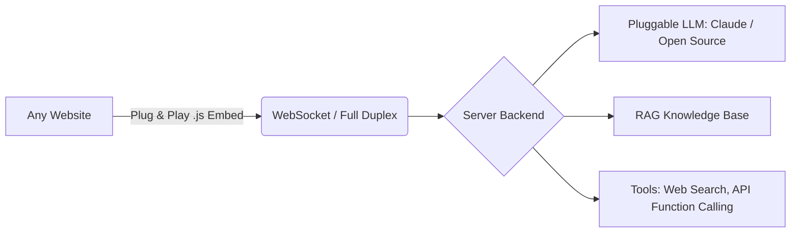

# Web Embeddable AI Agent for Web Accessibility
**Wildfire Hackathon Project**

A plug-and-play, LLM-powered AI agent designed to make any website instantly accessible. By simply embedding a tiny `.js` script, site owners can provide users with a fully autonomous voice assistant capable of navigating the website, executing tasks, and answering questions in real-time. 

## 🎯 The Problem: Web Accessibility is Hard
Millions of users face barriers navigating the modern web due to visual, motor, or cognitive impairments. Traditional accessibility compliance requires significant engineering resources, massive code rewrites, and constant maintenance.

## 💡 The Solution: Zero-Engineering Accessibility
Our solution is an embeddable AI Agent that acts as a personal co-pilot for the user. It bridges the accessibility gap by allowing users to interact with *any* website using natural language and voice commands. 

### ✨ Core Accessibility Features
*   🗣️ **AI Voice Assistance:** Users can communicate with the website via voice, removing the need for traditional keyboard/mouse navigation (vital for motor impairments).
*   🧭 **Autonomous Navigation:** The agent can physically navigate the website by itself based on user instructions (e.g., "Take me to the checkout page and apply my discount"). 
*   📚 **Cognitive Assistance via RAG:** Users who are overwhelmed by complex site layouts can simply ask questions. The agent uses Retrieval-Augmented Generation (RAG) to instantly fetch and summarize site-specific knowledge.
*   🔌 **Universal Plug & Play:** Site owners require **zero engineering**. Just drop in a `.js` embed file, and the site becomes accessible.

---
## Demo of Web Embedded AI Agent for Web Accessibility

https://github.com/user-attachments/assets/a71ae2dd-ebad-4c2b-8a42-3b1cd9ac26df

---
## 🏗️ How It Works (Architecture)

Our architecture is designed for speed, low latency, and infinite scalability using a Full Duplex WebSocket connection.

**Key Components:**
1. **Frontend:** A tiny, lightweight `.js` script embedded on the client's website.
2. **Connection:** Real-time Full Duplex WebSocket connection for instant voice and text feedback.
3. **Backend Logic:** Handles user intent, tool calling (like Web Search), and connects to customizable RAG implementations.
4. **Pluggable LLM:** Agnostic architecture allowing the use of Claude, OpenAI, or Open Source models depending on cost and privacy needs.

---

## 🚀 Getting Started (Developer Setup)

Follow these instructions to run the project locally for testing and development.

### Prerequisites
* Node.js (v18+)
* API Keys for your chosen LLM (e.g., Anthropic/Claude, OpenAI)

## 🔮 Future Roadmap
*   **Action Automation:** Expanding the function-calling tools to automatically fill out complex web forms for visually impaired users.
*   **Multi-Language Voice:** Real-time translation to break down language barriers.
*   **Screen Reader Integrations:** Deeper synergy with native OS accessibility tools (VoiceOver, NVDA).
